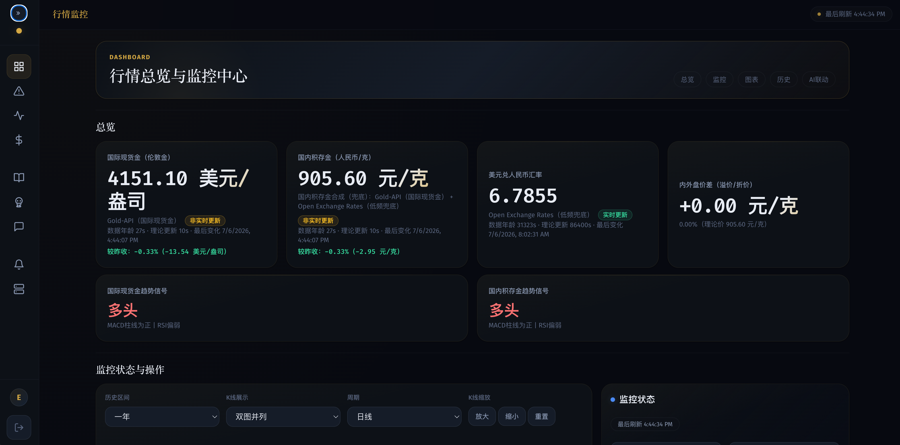
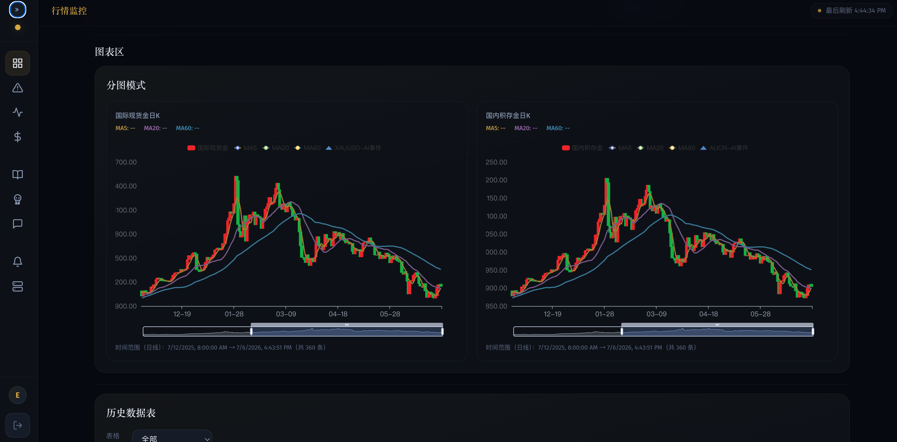

[](https://edisonturue.github.io/gold-monitor/)

# Gold Monitor

[**在线体验 Demo**](https://edisonturue.github.io/gold-monitor/) — 浏览器直接打开即可。

暗色金融风金价监控工具，免费公开数据源。

## 功能

- 国际/国内金价实时采集，阈值规则 + 组合条件 + 通知
- K线图表（MA5/MA20/MA60、RSI、MACD、趋势信号） + 策略回测
- AI 异动归因（涨跌自动触发新闻分析）
- 图形化管理后台，登录认证

## 界面预览





## 快速启动

```bash
./start
```

首次访问 `http://localhost:8080/setup` 初始化管理员账号。

## 环境变量

主要变量（完整列表见 `.env.example`）：

| 变量 | 默认值 | 说明 |
|------|--------|------|
| `PORT` | `8080` | 服务端口 |
| `POLL_INTERVAL_SEC` | `5` | 轮询间隔 |
| `SESSION_SECRET` | — | 会话签名密钥（部署必填） |
| `WECOM_WEBHOOK_URL` | — | 企业微信机器人 webhook |
| `DB_PATH` | `data/gold_monitor.db` | 数据库路径 |

## 常见问题

- **外网可以访问吗？** 部署到公网服务器后通过域名访问。
- **如何开启邮箱验证码？** 配置 SMTP 变量后，`/setup` 页面自动切换为邮箱验证流程。
- **如何开启 AI 归因？** 在 AI 研判标签页配置 OpenAI 兼容接口 + 涨跌阈值。
